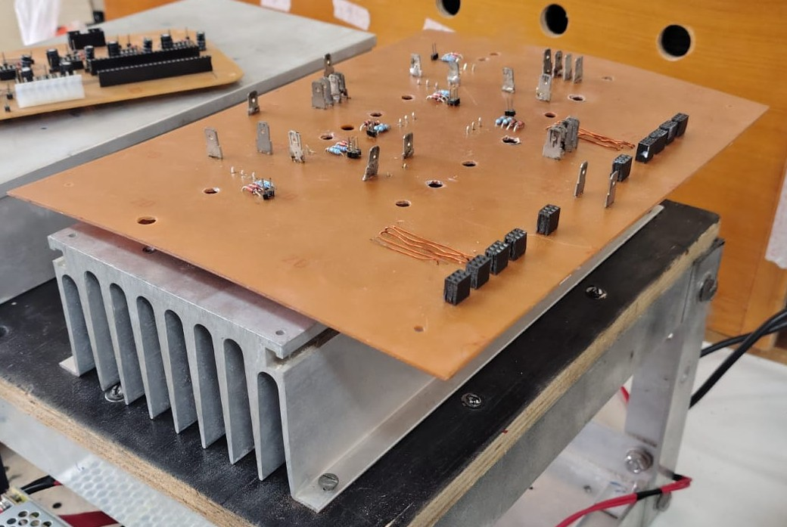
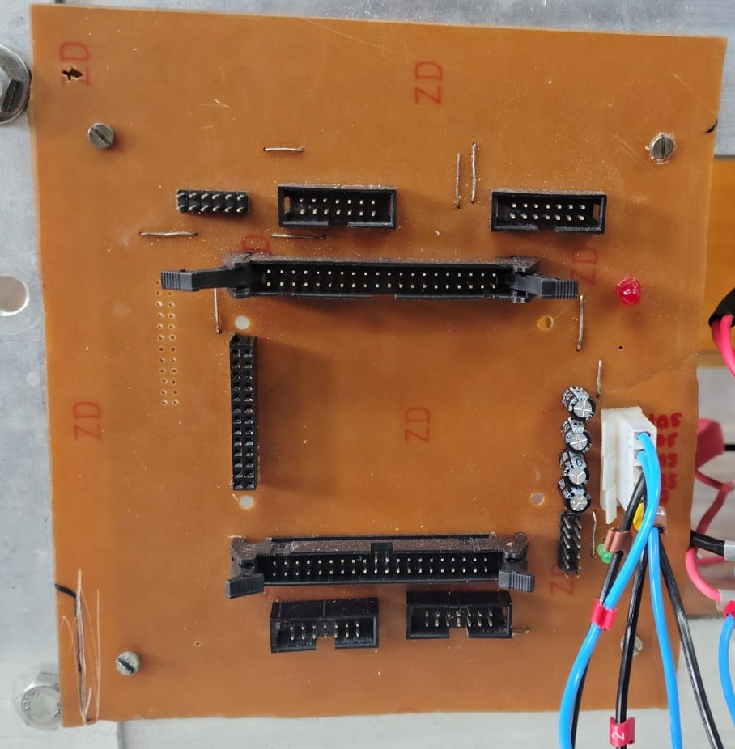
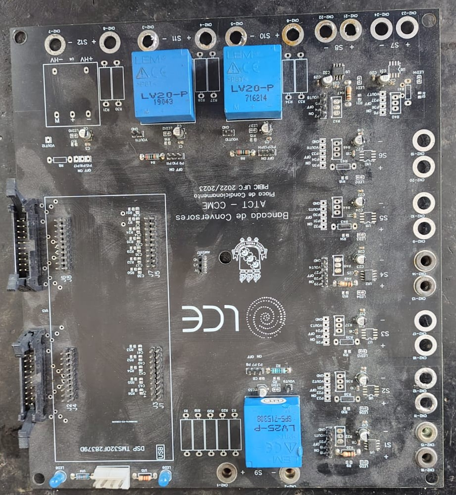
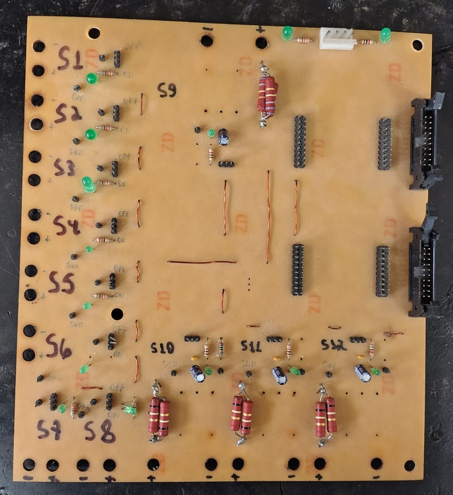
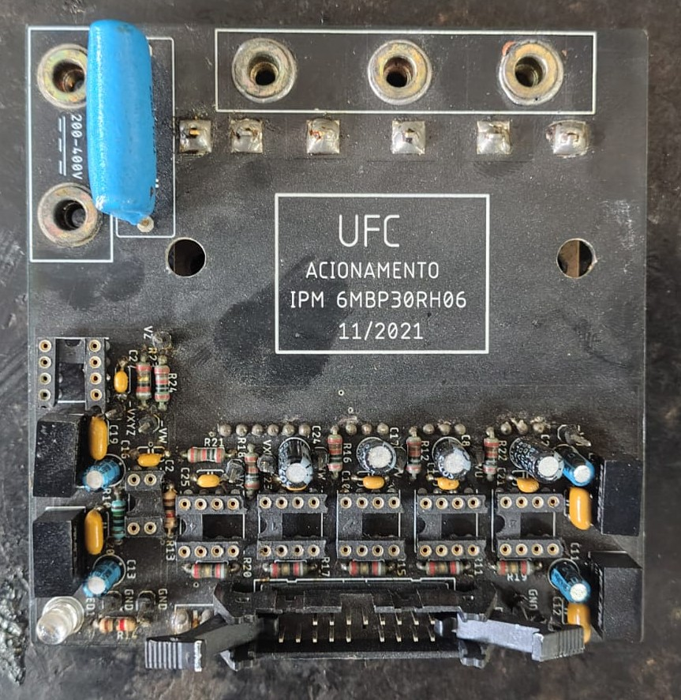
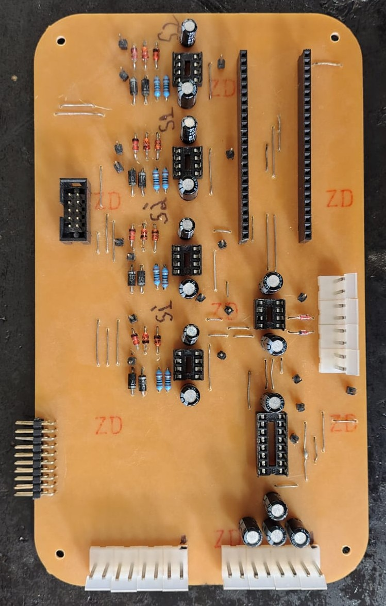

# Hi there! I'm Emanuel Mota 👋

**Power Electronics Researcher | M.Sc. Candidate in Electrical Engineering | BESS | Power Converters | Embedded Systems**

I am a Master's candidate in Electrical Engineering at the **Federal University of Ceará (UFC), Brazil**, working with power electronics, energy storage systems, digital control, and embedded systems.

My current research focuses on the development of **Battery Energy Storage Systems (BESS)** and grid-connected power converters, combining power-stage design, digital control, FPGA-based PWM generation, embedded firmware, and experimental validation.

---

# 👨‍💻 About Me

I am currently pursuing my **Master's degree in Electrical Engineering** at the **Federal University of Ceará (UFC)**.

My academic background is in **Electrical Engineering and Electronics**, with a research trajectory focused on power conversion and embedded systems.

My interest in power electronics started during my undergraduate studies with the development of a **battery charger for an exercise bicycle application**. This first project motivated me to explore power conversion systems in greater depth.

Since then, my projects have progressively evolved from battery charging and DC-DC conversion to **off-grid converters, power factor correction, UPS systems, multilevel inverters, and, currently, grid-connected Battery Energy Storage Systems**.

I particularly enjoy working across the complete development process, from simulation and circuit design to PCB development, embedded programming, hardware implementation, and experimental validation.

---

# 🔬 Research Interests

- Battery Energy Storage Systems (BESS)
- Grid-Connected Power Converters
- Power Electronics
- Multilevel Inverters
- Digital Control
- Embedded Systems
- FPGA-Based Control
- Renewable Energy Integration
- Energy Storage Systems

---

# 🚀 Featured Projects

## 🔋 Battery Energy Storage System (BESS) Inverter

**Ongoing Master's research project**

Development of a power conversion platform for **Battery Energy Storage Systems**, with emphasis on grid-connected operation and digital control.

The prototype is currently under development and involves the integration of:

- Power Converter
- Gate Driver Boards
- Analog Signal Conditioning
- Digital Control
- FPGA-Based PWM Generation
- Embedded Firmware
- Protection Systems
- Experimental Validation

**Technologies**

`STM32` `DSP` `FPGA` `VHDL` `Embedded C` `Power Electronics` `PCB Design`

> **Project status:** Hardware prototype currently under development.

---

## ⚡ Multilevel NPC Inverter

Development and experimental validation of a **Neutral Point Clamped (NPC) multilevel inverter** using FPGA-based PWM generation.

The project includes:

- VHDL Development
- POD PWM
- Digital PWM Generation
- Dead-Time Generation
- FPGA Implementation
- Gate Driver Interface
- Hardware Debugging
- Experimental Validation

---

## 🔌 UPS Development

Development of an embedded **Uninterruptible Power Supply (UPS)** platform involving power electronics, embedded systems, and protection circuits.

The project involved:

- Startup System
- Protection Circuits
- STM32 Hardware
- Embedded Firmware
- Grid Detection
- Power Converter Development
- Hardware Testing

---

## 📈 Energy Measurement System

Development of an embedded energy measurement platform based on STM32.

The system includes:

- ADC Acquisition
- RMS Calculation
- Energy Measurement
- UART DMA
- Digital Processing
- Communication Protocol
- Embedded Firmware

---

# 📷 Hardware Gallery

### Power Electronics Hardware

  
  

  
  

  
  

  
  

  
  

  
  

> The BESS prototype is currently under development. Additional hardware photographs will be added as the project progresses and the corresponding material becomes available for public disclosure.

---

# 🛠 Technical Skills

## ⚡ Power Electronics

- DC-DC Converters
- AC-DC Converters
- DC-AC Converters
- Full-Bridge Converters
- Half-Bridge Converters
- Flyback
- Push-Pull
- Boost
- PFC
- Multilevel Inverters
- Grid-Connected Converters
- Gate Driver Design
- Power Stage Development

---

## 💻 Embedded Systems

- STM32
- ESP32
- DSP
- FPGA
- Embedded Firmware
- Real-Time Control
- ADC Acquisition
- UART / DMA

---

## 👨‍💻 Programming & HDL

- Embedded C
- VHDL
- MATLAB
- Python

---

## 📐 PCB Design

- EasyEDA
- PCB Layout
- Schematic Design
- Power Electronics PCB Design
- Mixed-Signal PCB Design

---

## 🧪 Simulation & Engineering Tools

- PLECS
- PSIM
- LTspice
- MATLAB
- Mathcad
- STM32CubeIDE
- Quartus
- ModelSim

---

## 🔬 Laboratory & Experimental Validation

Experience with:

- Oscilloscopes
- Logic Analyzers
- Electronic Loads
- Function Generators
- Power Analyzers
- Digital Multimeters
- Current and Voltage Measurement
- Power Converter Testing
- Hardware Debugging

---

# 📚 Publications

### Modeling of a Single-Phase NPC Inverter with Nonlinear Load according to NBR 15204

**Accepted at the XXVI Brazilian Congress of Automation (CBA 2026).**

The work presents the modeling and analysis of a single-phase NPC inverter operating with a nonlinear load according to the requirements of **NBR 15204**.

---

# 💼 Professional Experience

## ⚡ Power Electronics Laboratory (LCE)

**Researcher**

Research and development activities involving:

- Battery Energy Storage Systems
- Grid-Connected Converters
- Multilevel Inverters
- DC-DC Converters
- Digital Control
- Embedded Systems
- FPGA Applications
- Hardware Development
- Experimental Validation

---

## 🏭 EMBRAPII

**PCB Designer & Test Engineer**

Professional experience involving the development and testing of electronic hardware, including:

- UPS Systems
- STM32-Based Hardware
- ESP32-Based Hardware
- PCB Design
- Power Converter Development
- Hardware Testing
- Experimental Validation

### Confidentiality Notice

Due to **confidentiality agreements and contractual obligations** with the companies involved, detailed technical information regarding some professional projects cannot be publicly disclosed.

This includes, when applicable:

- Schematics
- PCB layouts
- Source code
- Circuit specifications
- Design parameters
- Test results
- Proprietary architectures
- Other confidential technical information

---

# 📊 GitHub Statistics

  

---

# 📫 Contact

- 📧 **Email:** [edamota@alu.ufc.br](mailto:edamota@alu.ufc.br)
- 💼 **LinkedIn:** [Emanuel Mota](https://www.linkedin.com/in/emanuel-mota-66838719b/)
- 🎓 **Google Scholar:** [Emanuel Mota](https://scholar.google.com.br/citations?hl=pt-BR&user=IJ8S7VEAAAAJ&view_op=list_works)
- 🆔 **ORCID:** [0000-0002-2761-7049](https://orcid.org/0000-0002-2761-7049)

---

⭐ Feel free to explore my repositories and projects!
