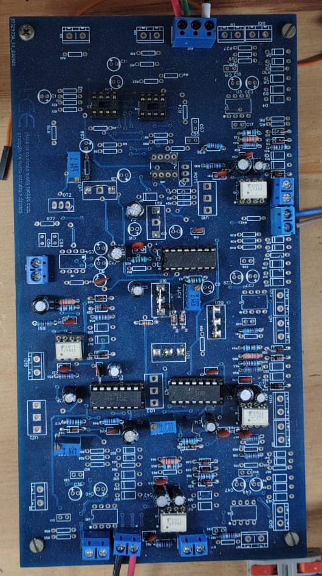
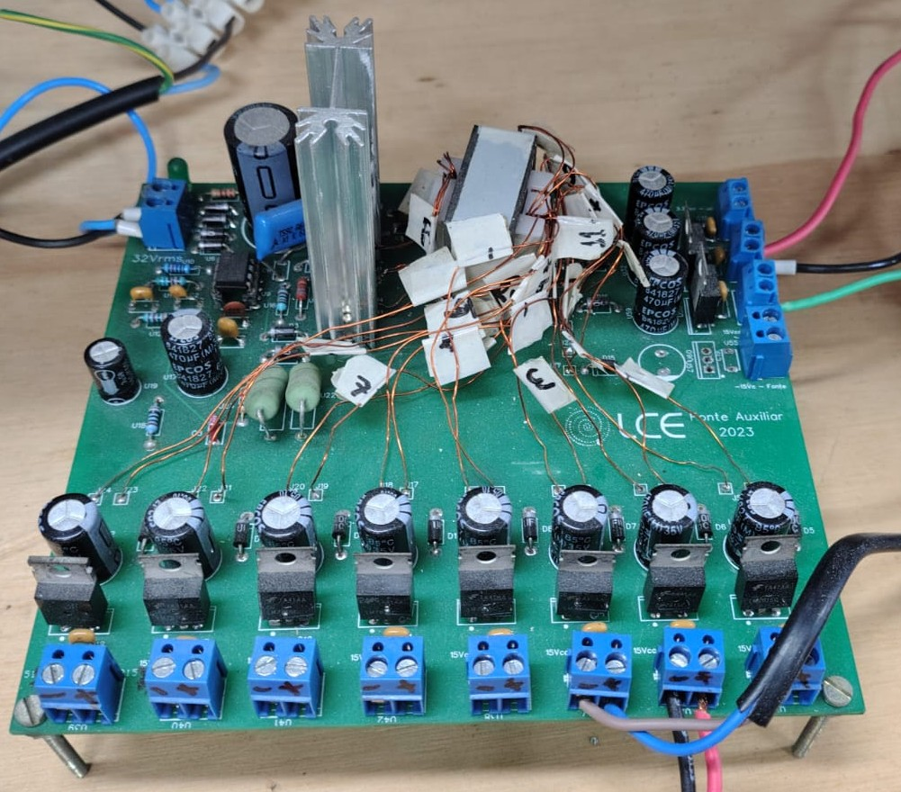
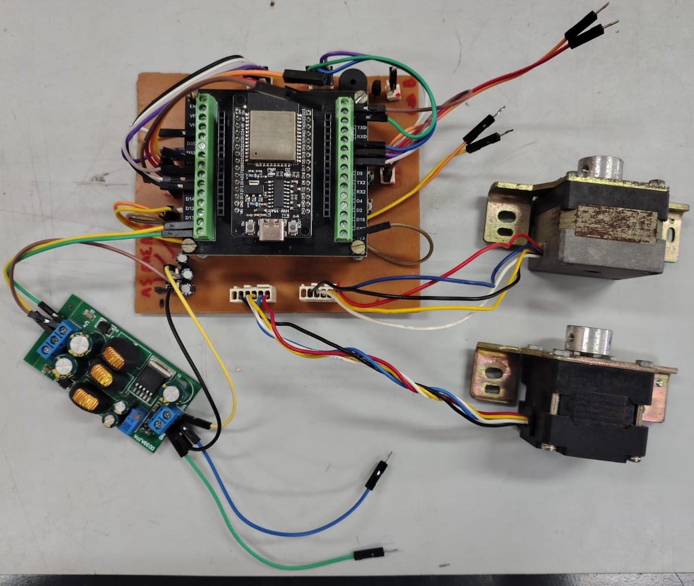
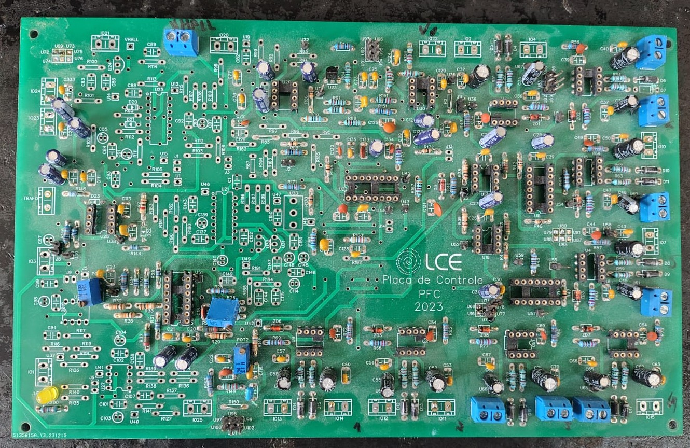

# Emanuel Mota  

  <b>Electrical Engineering Student</b> 
  Focused on <b>Power Electronics</b> ⚡ and <b>Embedded Systems</b> 🔧  

  
  

---

## 👨‍💻 About Me  

Electrical Engineering student with hands-on experience in:  

- ⚡ Power Electronics Converters  
- 🔧 Embedded Systems (STM32)  
- 🧠 Firmware Development (Embedded C)  
- 🪛 Hardware Prototyping & PCB Design  
- 📊 Hardware Validation & Testing  

---

## 🚀 Projects  

### 🔌 Hardware Projects  

#### Full Bridge Inverter  

  
  
  
  
  
  
  
  
  
  

🔎 Design and development of multiple power electronics boards, including inverter stages, PFC, flyback converters, and DSP-based control boards.  

➡️ [Project Details](projects/inverter.md)  

---

#### UPS Startup System  

  " width="350"/>

🔎 Development of a startup and protection system for UPS applications, focusing on safe grid interaction and control reliability.  

➡️ [Project Details](projects/ups.md)  

---

### 💻 Firmware Projects  

#### Energy Measurement System  

🔎 Embedded system for electrical parameter measurement using STM32, featuring:  
- UART DMA communication  
- Custom protocol with checksum  
- Energy and RMS calculation  

➡️ [Project Details](projects/energy_meter.md)  

---

## 🛠️ Technical Skills  

### ⚡ Hardware  
- Power Electronics  
- PCB Design (KiCad / Altium)  
- Analog Circuits  

### 💻 Firmware  
- STM32  
- Embedded C  
- UART DMA  
- Communication Protocols  

### 🔬 Tools  
- Oscilloscope  
- Logic Analyzer  
- STM32CubeIDE  

---

## 📎 Links  

- 🔗 GitHub: https://github.com/Emamnuel  
- 📁 Portfolio: https://github.com/Emamnuel/portfolio_Emanuel  

---

## 📌 Highlights  

- Strong focus on **real hardware implementation**  
- Experience with **power converters and grid interaction**  
- Development of **robust embedded communication systems**  
